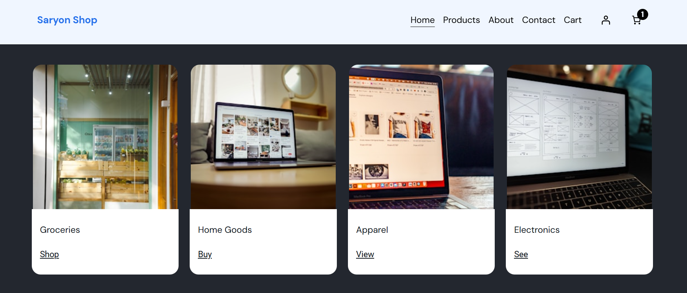
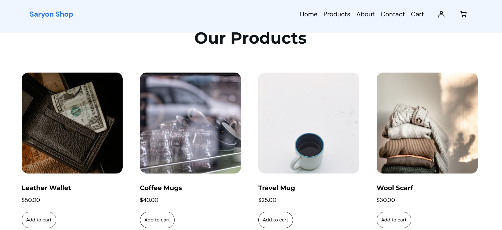
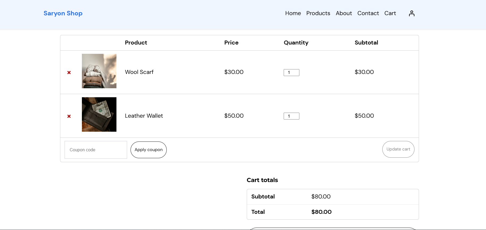

markdown
# E-Commerce Website - WordPress & WooCommerce

## Student Information

| Field | Details |
|-------|---------|
| Student Name | Abraham L.V Saryon |
| Registration Number | 23544/2023 |
| Course | Ecommerce |
| Instructor | Eric Maniraguha |

---

## Project Title

**E-Commerce Website Development using WordPress & WooCommerce**

---

## Platform Used

| Component | Technology |
|-----------|------------|
| Hosting | Hostinger (Subdomain) |
| CMS | WordPress 6.x |
| E-Commerce Plugin | WooCommerce |
| Theme | HostingerAI Theme (Free Version) |
| Language | PHP, HTML, CSS, JavaScript |
| Database | MySQL |
| Version Control | Git & GitHub |

---

## Features Implemented

### Homepage
- Store name displayed prominently
- Welcome message and brand introduction
- Featured products section with categories
- Navigation menu with all pages
- Hero/banner section with "Shop Now" CTA

### Product Page
- 5+ Products with detailed information:
  - Steel Straws Set - $12.00
  - Soy Candle - $20.00
  - Travel Backpack - $85.00
  - Ceramic Coffee Mug - $15.00
- Product images for each item
- Price display
- Product descriptions
- Add to cart buttons
- Product categories (Home Decor, Fresh Foods, Tech Gear, Accessories)

### About Page
- Store description
- Mission statement
- Store history
- Why choose us section
- Core values

### Contact Page
- Contact form (using Contact Form 7)
- Email address
- Phone number
- Physical address
- Business hours

### Cart Interaction
- Add to cart functionality
- View cart page
- Update quantities
- Remove items
- Cart total calculation
- Proceed to checkout

### Additional Features
- Responsive design (mobile-friendly)
- User-friendly navigation
- Professional appearance with HostingerAI Theme
- WordPress backend management
- WooCommerce integration
- Newsletter subscription section

---

## Screenshots

### Homepage

### Product Page

### Cart Page

---

## Repository Structure
ecommerce/
│
├── README.md # Project documentation
├── images/ # Screenshots folder
│ ├── homepage.png
│ ├── product-page.png
│ └── cart-page.png
└── (WordPress files on Hostinger)

text

---

## Live Website Link

**Live Website:** https://abrahamecommerce.vgmissionary.org/

---

## GitHub Repository

**Repository Link:** https://github.com/abrahamsaryon/ecommerce/

---

## Deployment Process

The website was deployed using Hostinger's one-click WordPress installer on a subdomain. The steps included:

1. Creating a subdomain in Hostinger hPanel
2. Using Hostinger's Auto Installer to install WordPress
3. Installing and activating HostingerAI theme
4. Installing WooCommerce and Contact Form 7 plugins
5. Creating products, pages, and customizing the site
6. Configuring the navigation menu and homepage settings

---
## Challenges Faced and Solutions

**Challenge 1: Hosting Platform Limitations**

**Issue:** Initially attempted to use WordPress.com free plan for the e-commerce website. Discovered that the free plan does not support WooCommerce or third-party plugin installations, which were essential for building the online store.

**Solution:** Switched to Hostinger hosting service which provides full WordPress installation with complete plugin support. This allowed installation of WooCommerce, Contact Form 7, and other necessary plugins.

---

**Challenge 2: Subdomain Dashboard Access**

**Issue:** After creating the subdomain on Hostinger, clicking the WordPress admin panel button in hPanel redirected to the main domain's dashboard instead of the subdomain's admin area.

**Solution:** Manually accessed the WordPress dashboard using the direct URL: https://abrahamecommerce.vgmissionary.org/wp-admin/. This bypassed the redirection issue and provided access to the correct admin interface.

---

**Challenge 3: Product Configuration and Categorization**

**Issue:** Configuring products with proper categories, descriptions, images, and pricing required careful planning to ensure a professional store appearance.

**Solution:** Created four main product categories (Home Decor, Fresh Foods, Tech Gear, Accessories) and added products with detailed descriptions, competitive pricing, and high-quality images. Each product was configured with the correct WooCommerce settings for inventory and display.

---

**Challenge 4: Theme Compatibility and E-commerce Features**

**Issue:** Finding a free theme that was fully compatible with WooCommerce and provided professional e-commerce features without paid upgrades.

**Solution:** Installed and activated the HostingerAI theme (free version), which offers complete WooCommerce integration, responsive design, and essential e-commerce features without requiring premium upgrades.
---

## Lessons Learned

### Technical Skills
1. WordPress Architecture - Understanding core files, themes, and plugins
2. Database Management - MySQL setup and configuration
3. Hosting - Deploying WordPress on Hostinger subdomain
4. E-Commerce Integration - WooCommerce plugin and its features
5. Version Control - Git and GitHub for project management
6. Documentation - Markdown for professional reporting

### Project Management
1. Planning and structuring project requirements
2. Problem-solving and debugging techniques
3. Attention to detail in implementation
4. Documentation and presentation skills

---
## Future Improvements

**Improvement 1: Domain and Hosting**

Deploy the website to a production environment with a custom domain name instead of a subdomain for a more professional appearance. Upgrade hosting plan to accommodate increased traffic and faster loading speeds.

---

**Improvement 2: Payment Gateway Integration**

Integrate payment gateways such as Stripe or PayPal to enable real payment processing. Add support for multiple payment methods including credit/debit cards and mobile money.

---

**Improvement 3: User Registration and Login**

Implement user registration and login functionality to allow customers to create accounts. Enable order history and saved preferences for returning customers.

---

**Improvement 4: Product Reviews and Ratings**

Add product reviews and ratings to help customers make informed purchasing decisions. Implement a wishlist feature for customers to save favorite products.

---

**Improvement 5: Product Search Functionality**

Implement advanced product search functionality with filters and sorting options. Add product recommendations based on browsing history and purchase patterns.

---

**Improvement 6: Shopping Cart Persistence**

Enable shopping cart persistence so items remain in the cart even after the user leaves the site. Implement cross-device cart synchronization for logged-in users.

---

**Improvement 7: Order Tracking System**

Enable order tracking system so customers can monitor their delivery status. Add email notifications for order confirmation and shipping updates.

---

**Improvement 8: Social Media Integration**

Integrate social media sharing buttons for products and pages. Connect the store to social media platforms for marketing and customer engagement.

---

**Improvement 9: Newsletter Subscription**

Implement newsletter subscription to keep customers informed about new products, promotions, and exclusive deals. Automate email marketing campaigns.

---

**Improvement 10: Mobile Responsiveness**

Enhance mobile responsiveness for better user experience on all devices. Optimize the layout for smartphones and tablets.

---

**Improvement 11: SEO Optimization**

Optimize website speed and SEO to improve search engine rankings. Implement meta tags, sitemaps, and structured data for better visibility.
---

## Contact

**Student Name:** Abraham L.V Saryon  
**Registration Number:** 23544/2023  
**Course:** Ecommerce  
**GitHub:** https://github.com/abrahamsaryon

---

## Acknowledgments

- Instructor: Eric Maniraguha for guidance
- WordPress Community for open-source software
- WooCommerce Team for e-commerce platform
- HostingerAI Theme Team for free theme
- Hostinger for hosting services

---

## License

This project is licensed under the MIT License - see the LICENSE file for details.
